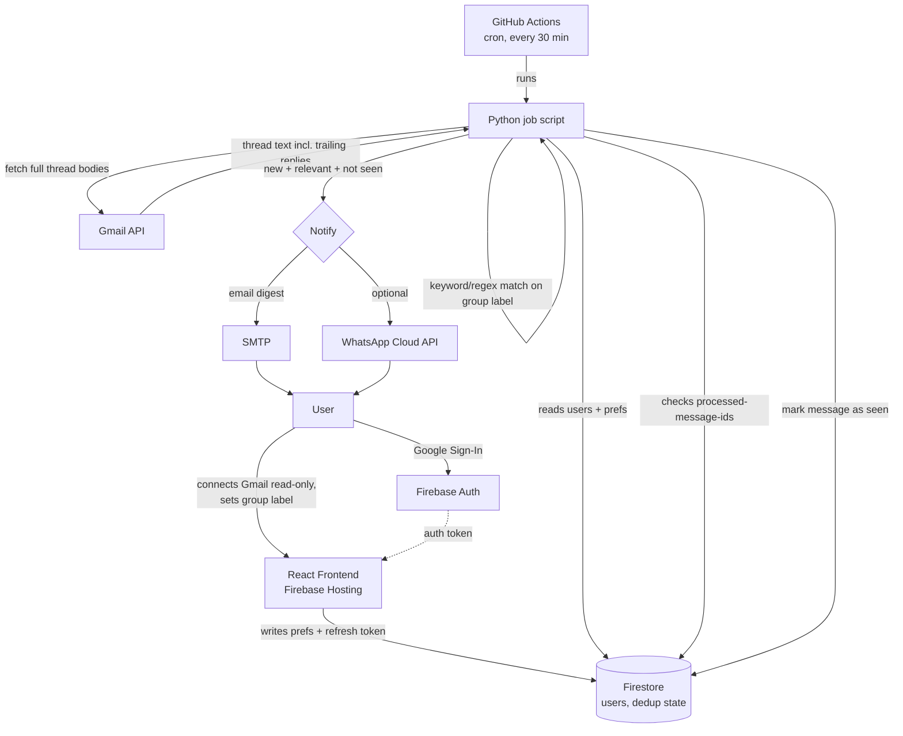

# InboxCopilot

> Group emails bury the one line that actually matters to you, deep inside a
> trailing reply on a thread you never open. InboxCopilot reads your Gmail
> (read-only), scans **full threads — not just the latest message** — and
> alerts you only when something is actually relevant to you. Nothing else.

**Status:** 🚧 In progress — Task 1 (scaffolding) complete.

---

## The problem

My college placement office emails every student about every company drive.
If I'm not applying to a company, I don't open that thread — but the
placement office often replies later, *on that same thread*, with things
like "A batch class cancelled tomorrow" or "A batch report to venue X, 9 AM."
Because it's a reply and not a new email, it's easy to miss it entirely —
and missing it can genuinely get you blocked from placements.

This isn't a placement-only problem. Any "sends-to-everyone, relevant-to-some"
mailing list has the same failure mode: college admin lists, hostel/society
notices, club or team mailing lists, HR announcements at work, event
organizing committees. **InboxCopilot is built around my own placement
inbox, but the underlying idea — watch a sender, scan full threads, alert
only on what applies to *your* group — works for anyone who deals with
one of these lists.** It's free to run and meant to be forked/adapted:
swap "batch" for whatever your own group label is (team, hostel block,
cohort, etc.) and point it at your own noisy sender.

## How it works

1. Sign in with Google
2. Connect Gmail (read-only) and tell it what to watch for — e.g. the
   sender's email address, and your "group" keyword (a batch, a team name,
   a hostel block — whatever applies to your mailing list)
3. A scheduled job periodically checks for new mail from that sender,
   reads the **full thread body, including trailing replies**
4. It extracts just the relevant sentence(s) and sends you an alert
   (email, and optionally WhatsApp) — only when something relevant is
   found, and never twice for the same message

## Architecture

A deliberate design choice: **no paid-tier gating, anywhere.** Google Cloud
Run / Cloud Scheduler require a billing account (card on file) even to use
their free tier. Instead, the scheduled job runs on **GitHub Actions**,
which is free with no card required, for scheduled ("cron") workflows on
public repos. This also means there's no always-on backend server to
deploy or pay for at all — the frontend talks to Firebase directly, and
the periodic check is just a script GitHub runs for us.

## Tech stack

- **Frontend:** React, deployed on Firebase Hosting — talks directly to
  Firebase Auth + Firestore, no custom backend API needed
- **Auth:** Firebase Authentication (Google Sign-In)
- **Database:** Firestore
- **Scheduled job:** a Python script, run on a cron schedule by
  **GitHub Actions** (free, no billing account required) — replaces what
  would otherwise be a Cloud Run + Cloud Scheduler setup
- **Notifications:** SMTP email (default), WhatsApp Cloud API (optional, per-user opt-in)
- **Cost:** genuinely $0, no billing account, no card, ever

## A deliberate scope decision: OAuth Testing mode

Gmail's read-only scope (`gmail.readonly`) is a Google "restricted" scope.
Getting it approved for public/unverified use requires Google's full app
verification process (security assessment, privacy policy review, etc.) —
appropriate for a real product, overkill for a personal tool.

Instead, this project keeps the OAuth consent screen in **Testing mode**,
which supports up to 100 manually-added test users with no verification
process. This is a **deliberate, disclosed limitation**, not an oversight:
anyone who wants to use InboxCopilot for themselves needs to be added as a
test user in the Google Cloud project (see Setup below), or they can deploy
their own copy of the project under their own Google account — which is
genuinely the intended way to use this, given it's a personal-inbox tool.

## Setup

*(step-by-step deployment instructions — coming as later tasks finish:
Google Cloud + Firebase project setup, OAuth consent screen, environment
variables, and the GitHub Actions workflow)*

## Why I built this

*(to be written once the project is deployed and working end-to-end)*

## License

MIT — free to use, fork, and adapt for your own inbox.
